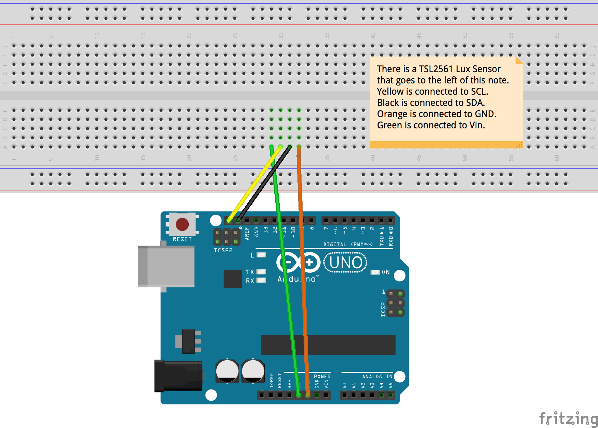

# Using Libs
This lab is to show how easy it is to add libraries to your Arduino sketch. In this example we make use of a Strinity Cobber v0.1 4-in-1 sensor board. This board uses I2C for
communication. In this lab we learn to add a library to make use of the Light sensor TSL2561 on the sensor board.

## The LAB
Connect TSL2561 to the Arduino.
