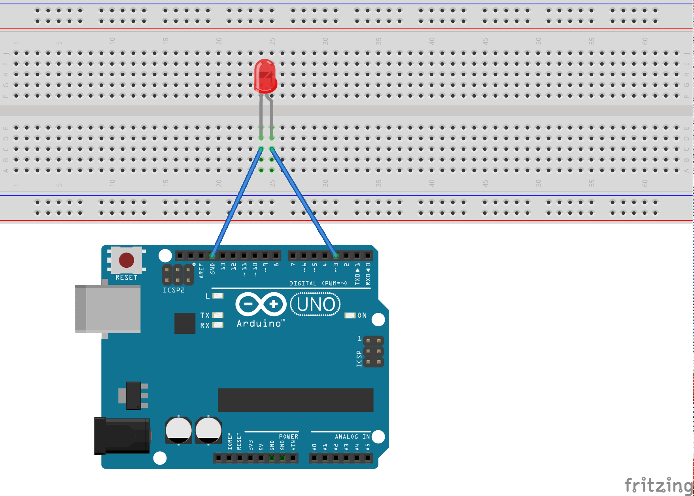

# Using PWM
Pulse Width Modulation signals are handy when you want to control motors or dim a led. Instead of using a DC voltage we switch the power on and off. The duration when the power is on is called pulse width. Depending on how long the power is in on against it’s off time we can control how much power a circuit will have.

## The LAB
Connect our LED to the Arduino.

We will use PWM pin on the Arduino and analogWrite() to set different duty cycles (from 0-255 where 0 is off and 255 is on).

50% Duty cycle by writing 128 to the PWM output

25% Duty cycle by writing 64 to the PWM output

12% Duty cycle by writing 32 to the PWM output
