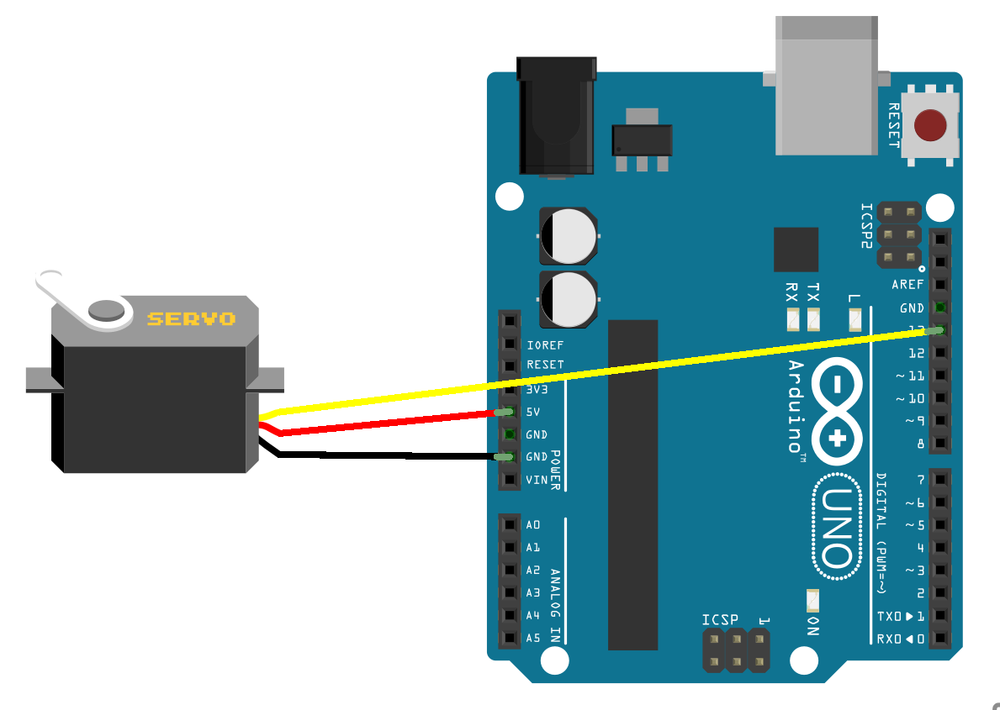

# Using a servo with Arduino
We want to use a servo motor in our project. A servo is an ordinary motor that is geared down and can be controlled to turn 180 degrees. There are servos, sometimes called continious servos, that can rotate full 360 degrees.

## Servo pulses
The servo is controlled by pulses, which it should receive roughly every 20 millisecond. The zero position, also called center (0 degrees), needs a pulse around 1.5 millisecond and then go low the rest of the 18.5 millisecond that is left (remeber total length is 20 ms). For -90 degress we can send a pulse that is 1ms long and then go low for 19ms. And for +90 degrees we send a pulse that is 2ms long and a go low for 18ms.

## The LAB
Connect our servo to the arduino.

The next step is to figure out the program.
We need to go high for 1000-2000 microseconds and go low until next pulse starts after 20 microseconds (with the full length).
It's a good idea not to go the whole 180 degrees, not all servos are created equal and may break, so try to stay between 1050 - 1950 microseconds.

Our example should produce pulses between 1050 - 1950 like this:

